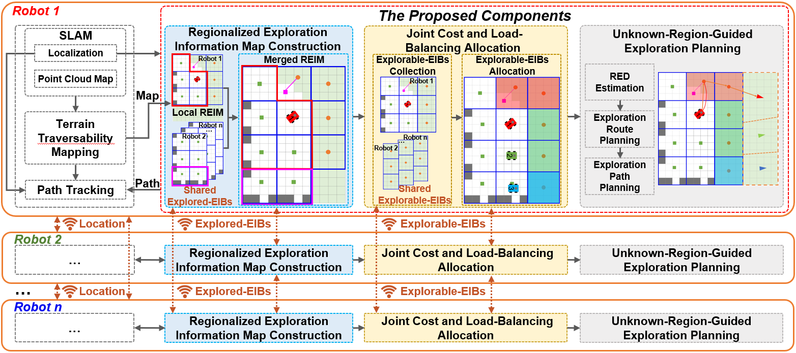
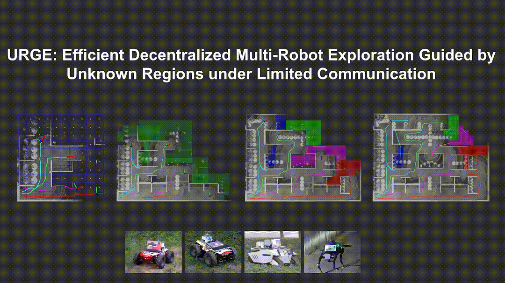
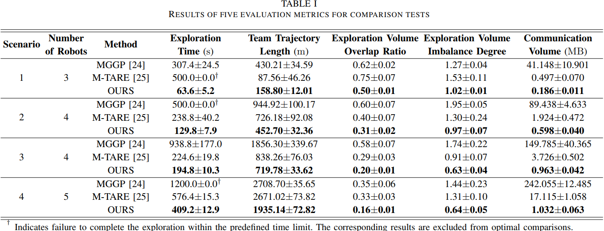

# URGE: Efficient Decentralized Multirobot Exploration Guided by Unknown Regions Under Limited Communication  

**Note:** This is the official implementation of the multirobot autonomous exploration framework **URGE**.

## URGE

Multirobot autonomous exploration often suffers from low efficiency and high communication overhead. To address this, we propose an **U**nknown-**R**egion-**G**uided, collaboration- and communication-efficient autonomous **E**xploration framework (**URGE**), which introduces a sub-region-based environmental representation and information sharing scheme to enable task allocation that jointly optimizes cost and load, ultimately achieving spatially dispersed exploration.  The proposed framework is evaluated using five metrics through extensive comparisons with state-of-the-art (SOTA) methods, ablation studies, and real-world experiments. Compared with the SOTA methods, URGE improves exploration efficiency by **13.3%–45.6%** and reduces redundant exploration by **22.5%–51.5%**. 

### Framework Overview

### Autonomous Exploration in a Forest

### Autonomous Exploration in a Parking lot

### Autonomous Exploration in a Tunnel

### Comparison Tests

### Comparison Results

## Table of Contents

* [Dependency](#0-Dependency)
* [Quick Start](#1-Quick-Start)
* [Detailed Description](#2-Detailed-Description)

### 0. Dependency

Coming Soon...

### 1. Quick Start

Coming Soon...

### 2. Detailed Description

Coming Soon...

## Acknowledgment

We sincerely appreciate the following open source projects: [FAST-LIO](https://github.com/hku-mars/FAST_LIO), [M-TARE](https://github.com/caochao39/mtare_planner), and [MGGP](https://github.com/MISTLab/MGGPlanner)

